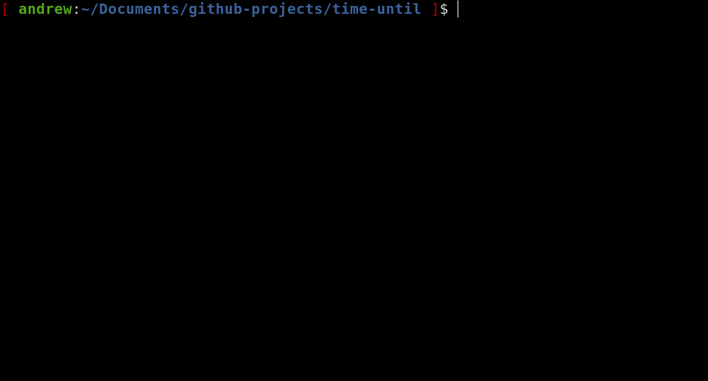
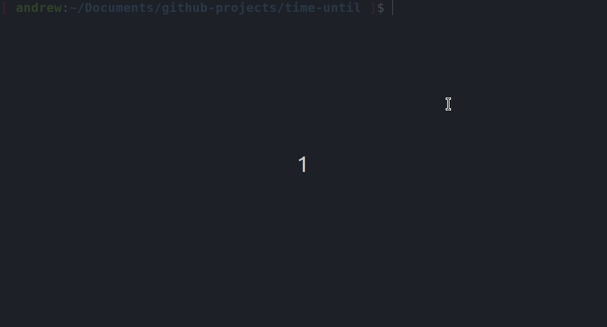

## `time-until.sh`

By Andrew W. Herring

---

A simple bash script for computing the number of years, days, hours, and minutes between now and some future date and time. Collection of user input and presentation of results are handled by [zenity](https://help.gnome.org/users/zenity/stable/) GUI's.

### Description

On execution, a zenity [calendar](https://help.gnome.org/users/zenity/stable/calendar.html.en) dialog prompts the user to select some future date and time (`$fdt`), and then a zenity [info](https://help.gnome.org/users/zenity/stable/info.html.en) dialog reports the number of years, days, hours, and minutes between the time of execution and `$fdt`:
<p align="center">
	
</p>

At the initial prompt, `time` values in both 12hr and 24hr formats are accepted:

<p align="center">
	
</p>

### Dependencies
* bash
* [zenity](https://help.gnome.org/users/zenity/)

### Usage
There are two primary methods for obtaining and using `time-until.sh`:

**Method 1:** Clone the repository into `dirname` on your local machine:
```bash
cd dirname
git clone https://github.com/andrewherring/time-until.sh.git
```
Depending on the configuration of `git` on your local machine, you may also need to enable execution:
```bash
chmod u+x ./time-until/time-until.sh
```
Execute the script:
```bash
./time-until/time-until.sh
```

**Method 2:** Download the raw script:
```bash
wget https://raw.githubusercontent.com/andrewherring/time-until.sh/master/time-until.sh
```
Enable execution:
```bash
chmod u+x time-until.sh
```
Execute:
	
```bash
./time-until.sh
```
	
### Bugs
**WARNING:** this script does not take leap years into account! 

Briefly, both the future date and time (`$fdt`) and the present are given as the number of seconds since 1 January, 1970 (i.e., each is specified using the format `date +%s`). The difference between these two time points is then carried through as the difference of these two numbers of seconds:
```bash
secdiff=$(( $(date +%s --date="$fdt")-$(date +%s) )) # line 15
```
The issue is then that the script assumes that there are always 365 days per year:
```bash
secperday=$(( $secperyear/365 )) # line 19
```
But this assumption is false during a leap year! 

### To Do

- [ ] fix the script so that it correctly handles leap years;
- [ ] add a button to the second zenity prompt which allows the user to perform a second calculation without having to re-execute the script.

### License
This project is licensed under the GNU General Public License v3.0 (see `license.txt`).

## Here's something new for ya